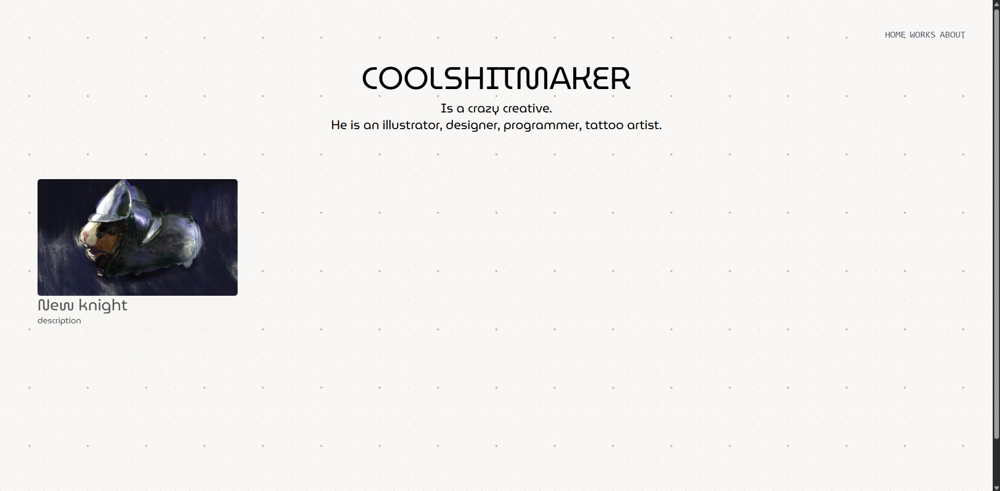
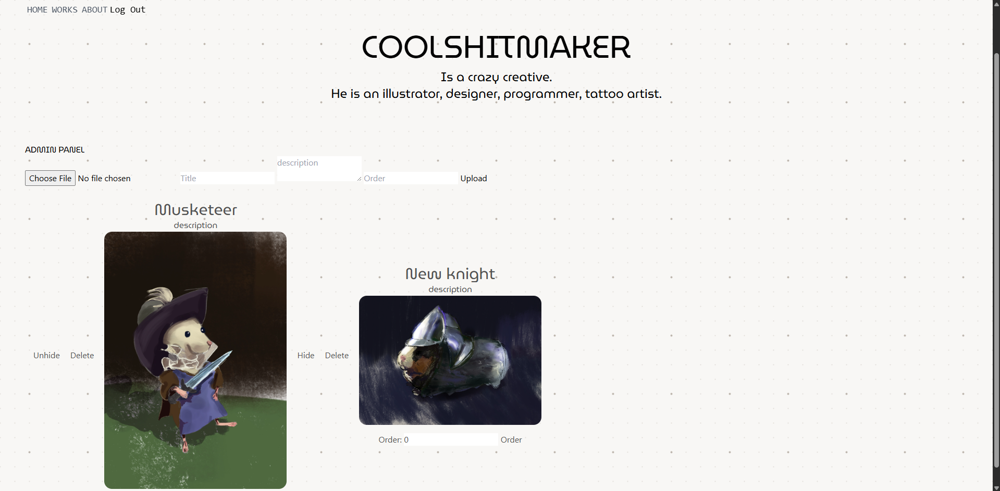
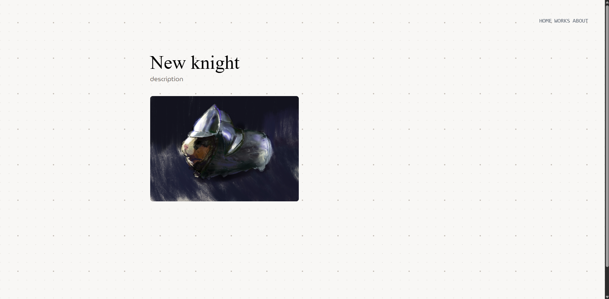
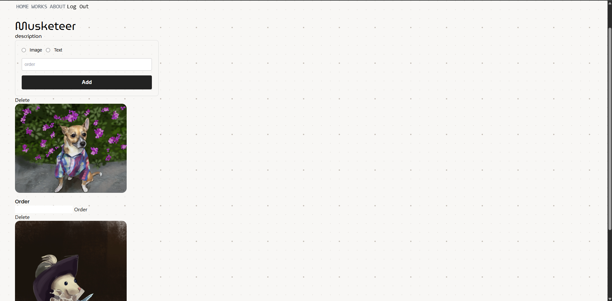
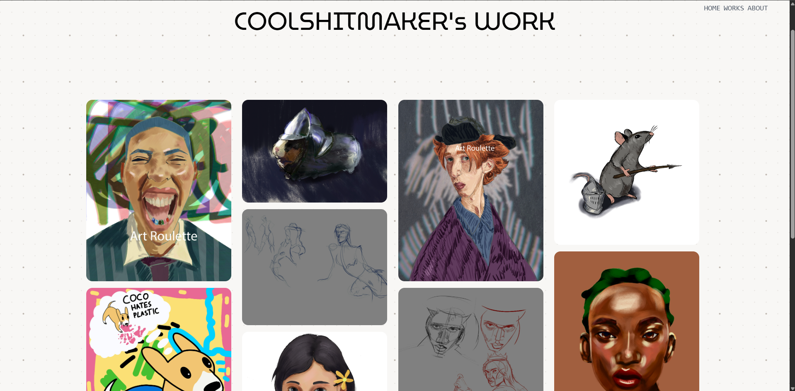
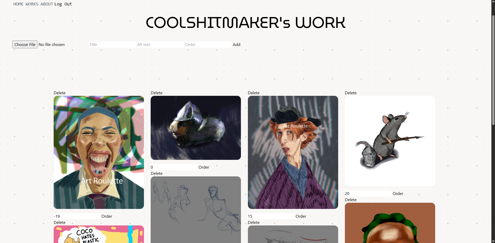
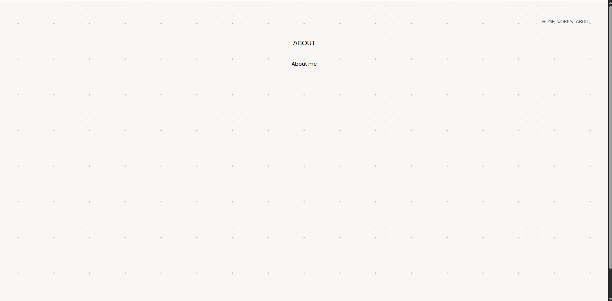
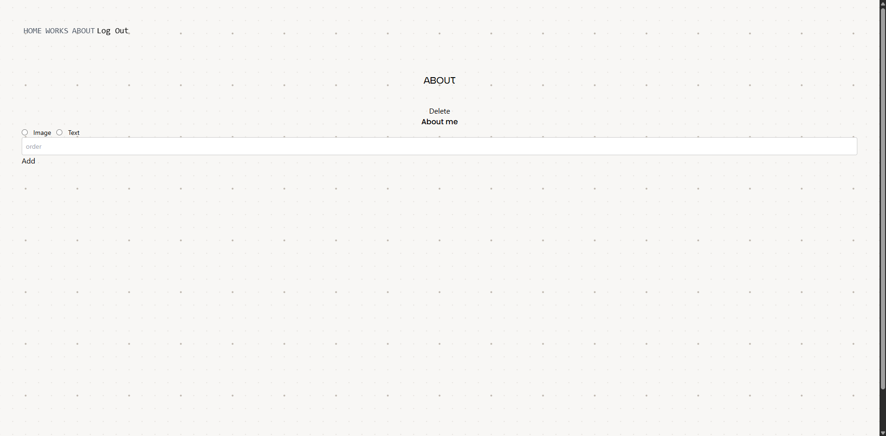

# CMS PORTFOLIO APP
#### Description: Web app that enables the changing of content directly from the webpage without having to add the files manually to the filesystem, or change the code in any way.

## 📖 Table of Contents
- [Introduction](#introduction)
- [Features](#features)
- [Screenshots](#screenshots)
- [Files](#files)
- [Future improvements](#future-improvements) 

---

# Introduction
This is **CMS** for a **portfolio**. I made it to solve a problem I had with my previous art portfolio -- having to manually add images and text into code. This CMS allows me to add the images and text from the websites` pages. Images are saved into the filesystem and their path into the database. Text is also saved into the database so, it's possible to change it. 
### Database design
One of the first hurdles I faced in this project is a database design. I had to choose between having a table for **images** that would reference the **project.id**, to control which images show in which project. 
\
\
In the end I went the other direcition -- I have the **images** table that will store only the images shown on [works.html](#works).  
\
\
**Projects** table includes the title and description of the project, a hidden column as a boolean which controls if the project is shown on the home page.It also, has a field column, that will reference the id from the fields table, to mark the field of the project.
\
\
**Project_contents** references the id from the **project** table. It includes the column of type -- either image or text and column content that stores the path or the text to be included.
\
\
### The app is separated into the public side and the admin side.
More details in [files](#files) section.

---

# Features
\
The functionalities that the CMS currently include:
### Homepage
 - Adding a new project to the homepage
 - Hiding/deleting an existing project from the homepage
 - Hiding a project from the homepage
 - Changing the order by which the projects are displayed
 \
 ### Project's page
 - Adding new image or text content to the page
 - Deleting the content from the page
 - Changing the order by which the content is displayed
 \
 ### Work page
 - Adding new images, including the title and alt text
 - Deleting existing images
 - Changing the order by which the images are displayed 
 \
 ### About page
 - Adding new image or text content
 - Deleting the existing content
 

---
# Files
### Python files

 `app.py`
\
Set's up the app and the session, and simply registers two blueprints - public.py and admin.py that handle public routes and admin routes.
\

`public.py`
Handles all of the public routes that the user can visit. It queries the database to get the content to be displayed on the webpage and sends it to the necessary page, for jinja to handle. All of the public routes handle only "GET" requests.
\
There are 4 routes accessible by the not-logged in users. 

`admin.py`
\
Handles all of the admin routes. There are 15 routes in total, all of which require the login, except the actual login route.
All of the routes display the same content as the public routes, with added functionality to change the displayed content.

`helpers.py`
\
A lot of helpers.py functionality is added from the CS50 week 9 - finance problem. 
\
It registers a database object, creates the apology function and login required.
\
A new addition is a new function used in admin.py to get the project's id from the page.

`hash.py`
\
Hash.py is a file that's only ran once, to insert the username and hashed password in the database.

### HTML Templates

All of the html pages check if the session exists to know if the admin is logged in and render the page accordingly.\
The admin routes send POST requests and the data received is immediately inserted into the database.
`layout.html` 

This is the base template for all pages. It includes a navigation for the admin and user and the empty main block.

`index.html`

Loops through the list of dictionaries sent by flask to dispaly the projects, titles and description. 
### Public home page

### Admin home page
  

`project.html`
 
 When the user clicks on the project on the homepage, the id of the project is sent to flask and the project route. It then queries the database to get the content of the project, and sends it to the project.html for jinja to handle.

### Public project page

### Admin project page
  

`works.html`

Shows all of the images, from the images table.

### Public works page

### Admin works page
 

`about.html`

### Public about page

### Admin about page 
  

`apology.html`

Simply renders the apology from the admin if something goes wrong.

### SQL and database
`schema.sql` has the schema of the database - `portfolio.db`
---
# Future improvements 

There are several planned improvements.
* Hide the content on the project's page and works page, without deleting it.
* Display the fields of projects and images on the page.
* Filtering by field on the works page.